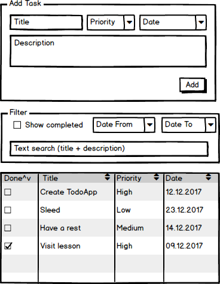

# Todo list app
The application consists of three parts:

* Form of adding tasks
* Filter for task list
* Список задач

## Create project like Todo list

### Implement the application on the reactants
